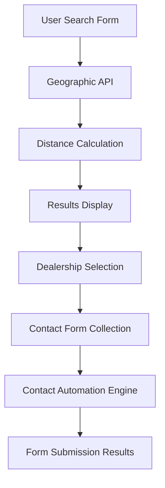

# Geographic Distance Functionality Documentation

**For UI Development and API Integration**

## 🎯 **Core Functionality Overview**

The system now provides precise geographic filtering of dealerships based on user location, enabling customers to find nearby dealerships for their car shopping needs.

### **Primary Function**
```python
find_dealerships_by_distance(make, zipcode, radius_miles, max_results=20)
```

### **Business Use Case**
User enters their zipcode and preferred vehicle make → System returns nearby dealerships sorted by distance → User can contact closest dealerships for quotes/visits.

---

## 📊 **API Specification for UI Integration**

### **Input Parameters**

| Parameter | Type | Required | Description | Examples | Validation |
|-----------|------|----------|-------------|----------|------------|
| `make` | string | Yes | Vehicle make to search for | "Jeep", "Ram", "Chrysler", "Dodge" | Case-insensitive, partial match |
| `zipcode` | string | Yes | User's zipcode | "90210", "10001", "60601" | 5-digit US zipcode |
| `radius_miles` | number | Yes | Search radius in miles | 25, 50, 100 | 1-500 mile range |
| `max_results` | number | No | Maximum results to return | 20 (default), 10, 50 | 1-100 limit |

### **Response Format**

```json
{
  "success": true,
  "user_location": {
    "zipcode": "90210",
    "latitude": 34.0942,
    "longitude": -118.4114,
    "geocoded_address": "Beverly Hills, CA"
  },
  "search_parameters": {
    "make": "Jeep",
    "radius_miles": 25,
    "max_results": 20
  },
  "results": {
    "total_found": 5,
    "dealerships": [
      {
        "dealer_name": "Santa Monica Chrysler Jeep Dodge And Ram",
        "address": "3219 Santa Monica Blvd, Santa Monica, CA 904042605",
        "city": "Santa Monica",
        "state": "CA",
        "zipcode": "90404",
        "phone": "310-829-3200",
        "website": "https://www.santamonicachrysler.com",
        "distance_miles": 5.0,
        "latitude": 34.0345,
        "longitude": -118.4845,
        "contact_form_available": true
      }
    ]
  },
  "performance": {
    "geocoding_time_ms": 1250,
    "search_time_ms": 340,
    "total_time_ms": 1590
  }
}
```

### **Error Responses**

```json
{
  "success": false,
  "error": {
    "code": "GEOCODING_FAILED",
    "message": "Could not geocode zipcode: 99999",
    "suggestions": ["Check zipcode format", "Try nearby zipcode"]
  }
}
```

**Error Codes:**
- `INVALID_ZIPCODE`: Zipcode format invalid
- `GEOCODING_FAILED`: Could not find coordinates for zipcode
- `NO_DEALERSHIPS_FOUND`: No dealerships of specified make in radius
- `INVALID_MAKE`: Make not recognized
- `RADIUS_TOO_LARGE`: Radius exceeds maximum (500 miles)

---

## 🎨 **UI/UX Requirements & Recommendations**

### **Search Form Components**

#### **Make Selection**
```html
<select name="make" required>
  <option value="">Select Vehicle Make</option>
  <option value="Jeep">Jeep</option>
  <option value="Ram">Ram</option>
  <option value="Chrysler">Chrysler</option>
  <option value="Dodge">Dodge</option>
</select>
```

#### **Zipcode Input**
```html
<input
  type="text"
  name="zipcode"
  placeholder="Enter your zipcode (e.g., 90210)"
  pattern="[0-9]{5}"
  maxlength="5"
  required
>
```

#### **Radius Slider/Select**
```html
<input
  type="range"
  name="radius"
  min="5"
  max="100"
  value="25"
  step="5"
>
<span>Within <span id="radius-display">25</span> miles</span>
```

### **Results Display Components**

#### **Results Summary**
```html
<div class="search-results-summary">
  <h3>Found {{total_found}} {{make}} dealerships within {{radius}} miles of {{zipcode}}</h3>
  <p>Showing closest dealerships first</p>
</div>
```

#### **Dealership Card Layout**
```html
<div class="dealership-card">
  <div class="dealership-header">
    <h4>{{dealer_name}}</h4>
    <span class="distance-badge">{{distance_miles}} miles</span>
  </div>

  <div class="dealership-details">
    <p class="address">📍 {{address}}</p>
    <p class="phone">📞 {{phone}}</p>
    <p class="website">🌐 <a href="{{website}}">Visit Website</a></p>
  </div>

  <div class="dealership-actions">
    <button class="btn-primary" onclick="contactDealer('{{dealer_name}}')">
      Contact Dealer
    </button>
    <button class="btn-secondary" onclick="getDirections({{latitude}}, {{longitude}})">
      Get Directions
    </button>
  </div>
</div>
```

### **Map Integration**

#### **Map Display Options**
1. **List View Only** - Simple, fast loading
2. **Map + List** - Visual + detailed information
3. **Map Only** - Geographic visualization

#### **Map Markers**
```javascript
// User location marker (blue)
const userMarker = {
  position: { lat: user_latitude, lng: user_longitude },
  icon: 'user-location-icon.png',
  title: 'Your Location'
};

// Dealership markers (red, numbered by distance)
const dealershipMarkers = dealerships.map((dealer, index) => ({
  position: { lat: dealer.latitude, lng: dealer.longitude },
  icon: `dealership-icon-${index + 1}.png`,
  title: `${dealer.dealer_name} (${dealer.distance_miles} miles)`,
  infoWindow: dealerInfoWindow(dealer)
}));
```

---

## ⚡ **Performance Considerations for UI**

### **Loading States**

#### **Search Progress Indicators**
```javascript
const searchStates = {
  IDLE: 'Ready to search',
  GEOCODING: 'Finding your location...',
  SEARCHING: 'Searching for dealerships...',
  COMPLETE: 'Search complete',
  ERROR: 'Search failed'
};
```

#### **Caching Strategy**
- **Zipcode geocoding**: Cache coordinates for 24 hours
- **Search results**: Cache for 1 hour (dealership data changes infrequently)
- **User preferences**: Remember last search parameters

### **Response Time Expectations**
- **First search**: 2-4 seconds (includes geocoding)
- **Cached zipcode**: <1 second
- **Radius changes**: <500ms (no re-geocoding needed)

---

## 🔄 **Workflow Integration**

### **Step 1: Geographic Search**
1. User enters make, zipcode, radius
2. System geocodes zipcode → lat/lng
3. Calculate distances to all dealerships
4. Filter by make and radius
5. Return sorted results

### **Step 2: Dealership Selection**
1. User browses results
2. Clicks "Contact Dealer" button
3. **Integration Point**: Launch contact form automation
4. Use existing `final_retest_with_contact_urls.py` functionality

### **Step 3: Form Automation**
1. Open dealership website
2. Navigate to contact page
3. Detect and fill contact form
4. Submit inquiry
5. Capture confirmation/response

### **Complete User Journey**
```
Geographic Search → Dealership Selection → Contact Form Automation → Lead Submission
```

---

## 🛠 **Backend API Endpoints**

### **RESTful API Design**

#### **Search Endpoint**
```
POST /api/v1/dealerships/search
Content-Type: application/json

{
  "make": "Jeep",
  "zipcode": "90210",
  "radius_miles": 25,
  "max_results": 20
}
```

#### **Geocoding Endpoint** (Optional)
```
GET /api/v1/geocode?zipcode=90210

Response:
{
  "zipcode": "90210",
  "latitude": 34.0942,
  "longitude": -118.4114,
  "city": "Beverly Hills",
  "state": "CA"
}
```

#### **Makes Endpoint** (For dropdown population)
```
GET /api/v1/dealerships/makes

Response:
{
  "makes": [
    {"value": "Jeep", "label": "Jeep", "count": 1791},
    {"value": "Ram", "label": "Ram", "count": 1341},
    {"value": "Chrysler", "label": "Chrysler", "count": 987},
    {"value": "Dodge", "label": "Dodge", "count": 1205}
  ]
}
```

---

## 📱 **Mobile Responsiveness**

### **Mobile-First Considerations**

#### **Search Form (Mobile)**
- **Stack inputs vertically** on small screens
- **Large touch targets** for buttons and sliders
- **Auto-focus zipcode** input for faster entry
- **Use device location** as optional zipcode alternative

#### **Results Display (Mobile)**
- **Card-based layout** with clear spacing
- **Swipe gestures** for browsing results
- **Tap-to-call** phone numbers
- **Tap-to-navigate** addresses

#### **Progressive Enhancement**
```javascript
// Check for geolocation support
if (navigator.geolocation) {
  // Offer "Use My Location" button
  // Convert coordinates to zipcode
}

// Check for touch device
if ('ontouchstart' in window) {
  // Optimize for touch interactions
  // Larger buttons, swipe gestures
}
```

---

## 🎯 **Advanced Features for Future UI**

### **Smart Defaults**
- **Remember last search** parameters
- **Suggest popular makes** based on location
- **Auto-adjust radius** if no results found

### **Enhanced Filtering**
```javascript
const advancedFilters = {
  business_hours: 'open_now',
  has_website: true,
  phone_available: true,
  distance_sort: 'closest_first',
  results_per_page: 20
};
```

### **Bulk Contact Features**
- **Select multiple dealerships** for batch contact
- **Compare dealerships** side-by-side
- **Save favorites** for later contact
- **Export results** to PDF/email

### **Analytics Integration**
```javascript
// Track search patterns
analytics.track('dealership_search', {
  make: searchParams.make,
  zipcode_state: zipcodeToState(searchParams.zipcode),
  radius_miles: searchParams.radius,
  results_found: response.total_found,
  search_time_ms: response.performance.total_time_ms
});
```

---

## 🔗 **Integration with Existing Contact Automation**

### **Handoff to Contact System**
```javascript
function contactDealer(dealerInfo) {
  // Prepare contact automation request
  const contactRequest = {
    dealer_name: dealerInfo.dealer_name,
    dealer_website: dealerInfo.website,
    user_info: getUserContactInfo(),
    vehicle_interest: getVehicleInterest(),
    automation_script: 'final_retest_with_contact_urls.py'
  };

  // Launch contact automation
  return automateContactForm(contactRequest);
}
```

### **User Information Collection**
```html
<form id="contact-info-form">
  <input name="first_name" placeholder="First Name" required>
  <input name="last_name" placeholder="Last Name" required>
  <input name="email" type="email" placeholder="Email" required>
  <input name="phone" type="tel" placeholder="Phone" required>
  <input name="zipcode" placeholder="Zipcode" required>
  <textarea name="message" placeholder="I'm interested in..."></textarea>
</form>
```

---

## 📊 **Data Flow Architecture**

### **Frontend → Backend → Contact Automation**



### **Database Schema Considerations**
```sql
-- Search history for analytics
CREATE TABLE search_history (
    id SERIAL PRIMARY KEY,
    session_id VARCHAR(64),
    zipcode VARCHAR(5),
    make VARCHAR(50),
    radius_miles INTEGER,
    results_found INTEGER,
    search_timestamp TIMESTAMP,
    user_agent TEXT
);

-- Contact attempts tracking
CREATE TABLE contact_attempts (
    id SERIAL PRIMARY KEY,
    search_id INTEGER REFERENCES search_history(id),
    dealer_name VARCHAR(255),
    dealer_website VARCHAR(255),
    automation_status VARCHAR(50),
    contact_timestamp TIMESTAMP,
    success_rate DECIMAL(3,2)
);
```

---

## 🎨 **UI Component Library Requirements**

### **Core Components Needed**

1. **`<GeographicSearch>`** - Main search form
2. **`<DealershipCard>`** - Individual dealer display
3. **`<DealershipList>`** - Results container
4. **`<DistanceMap>`** - Map integration
5. **`<ContactModal>`** - Contact form overlay
6. **`<LoadingSpinner>`** - Search progress
7. **`<ErrorMessage>`** - Error handling

### **Props and State Management**

```typescript
interface GeographicSearchProps {
  onSearch: (params: SearchParams) => Promise<SearchResults>;
  defaultMake?: string;
  defaultRadius?: number;
  showMap?: boolean;
}

interface SearchParams {
  make: string;
  zipcode: string;
  radius_miles: number;
  max_results?: number;
}

interface DealershipInfo {
  dealer_name: string;
  address: string;
  city: string;
  state: string;
  phone: string;
  website: string;
  distance_miles: number;
  latitude: number;
  longitude: number;
}
```

---

## 🚀 **Implementation Roadmap**

### **Phase 1: Basic UI (Week 1)**
- ✅ Geographic search function (COMPLETE)
- 🔄 Simple search form
- 🔄 Basic results list
- 🔄 Distance sorting

### **Phase 2: Enhanced UX (Week 2)**
- 🔄 Map integration
- 🔄 Mobile responsiveness
- 🔄 Loading states
- 🔄 Error handling

### **Phase 3: Contact Integration (Week 3)**
- 🔄 Contact form collection
- 🔄 Integration with automation scripts
- 🔄 Progress tracking
- 🔄 Results reporting

### **Phase 4: Advanced Features (Week 4)**
- 🔄 Bulk contact features
- 🔄 Analytics integration
- 🔄 Performance optimization
- 🔄 User preferences

---

**📝 Summary**: The geographic functionality provides a solid foundation for building a user-friendly dealership discovery interface. The API is designed for easy frontend integration with clear data structures and comprehensive error handling.